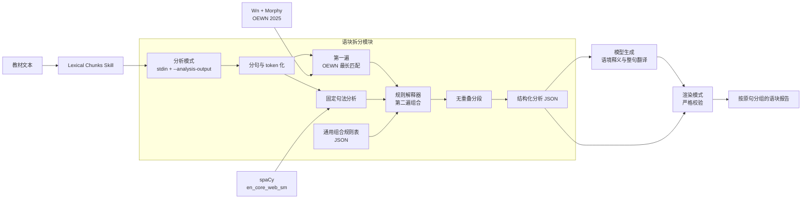

# 教材语块拆分工具与架构

本文记录教材语块拆分模块当前实现的外部 interface、内部工具关系、规则和能力边界。

## 实现状态

当前版本已经实现两遍拆分：第一遍选择最长且互不重叠的 Open English WordNet（OEWN）命中，第二遍依据固定句法模型和版本化通用规则组合相邻单位。拆分结果通过结构化 JSON 交给模型补充简体中文语境释义，再由脚本校验并按原句分组渲染报告。

| 能力 | 状态 |
|---|---|
| 固定版本 OEWN 与 Morphy 词形变体 | 已实现 |
| 最长且互不重叠的 OEWN 选择 | 已实现 |
| 固定版本英语句法分析 | 已实现 |
| JSON 通用组合规则表与解释器 | 已实现 |
| 无重叠最终分段 | 已实现 |
| 逐语块语境释义与整句翻译 | 已实现，由模型生成 |
| 学习价值判断、非连续语块 | 不在当前版本范围内 |

## 外部 interface

Lexical Chunks Skill 通过两个 CLI 模式衔接确定性拆分和模型释义：

- 分析：`--analysis-output <路径>` 从标准输入读取英文教材，输出带 `schema_version`、原句和语块数组的 JSON。
- 注释：模型按分析 JSON 的位置生成 `chunk_meanings` 和 `sentence_translation`，不重复英文内容。
- 渲染：`--render-analysis <路径> --output <路径>` 加载分析 JSON，从标准输入读取注释 JSON，严格校验后生成 Markdown。
- 兼容模式：不传分析或渲染参数时，仍生成原有英文单列表格。
- 输出：分析和渲染模式都在标准输出打印实际产物的绝对路径。
- 默认路径：`outputs/lexical-chunks/text.chunks.md`；文件已存在时递增文件名。
- 错误：没有英文输入、固定依赖不可用或注释校验失败时返回非零状态；校验失败不会创建残缺报告。

CLI 是语块拆分模块唯一对 Skill 暴露的 interface。结构化分析 JSON 是模型参与的唯一 seam：模型可以补充中文，但不能修改英文分段。

两个 JSON interface 都使用 `schema_version: 1`。分析文件按顺序保存：

```json
{
  "schema_version": 1,
  "sentences": [
    {"sentence": "Dogs bark.", "chunks": ["Dogs", "bark"]}
  ]
}
```

模型返回的注释只按位置提供中文，不携带可被改写的英文：

```json
{
  "schema_version": 1,
  "sentences": [
    {
      "chunk_meanings": ["狗", "吠叫"],
      "sentence_translation": "狗会吠叫。"
    }
  ]
}
```

根对象和句子对象均拒绝未知字段。注释的句子数和每句释义数必须与分析完全一致，所有释义与整句翻译必须是非空字符串。

## 当前架构



OEWN 和句法模型提供两种不同证据，规则表声明允许组合的结构，解释器负责执行规则并消除冲突。最终分段不由 Skill、Wn 或 spaCy 单独决定。

## 模块职责

| 部分 | 职责 |
|---|---|
| Lexical Chunks Skill | 传递教材、生成中文注释、调用两种 CLI 模式并只返回最终链接 |
| CLI | 生成结构化分析或校验注释并渲染报告，返回产物路径或错误状态 |
| 分句与 tokenizer | 生成句子和带原文字符区间的 token；把 `1,500` 等数字保留为一个 token |
| OEWN 匹配 | 使用 Morphy 词形变体和内存前缀树收集连续多词候选 |
| 最长匹配选择 | 按长度降序、位置升序选择互不重叠的 OEWN 候选 |
| 固定句法分析 | 提供词性、依存关系和字符位置，不直接决定最终语块 |
| 通用组合规则表 | 以版本化 JSON 声明左右条件、句法关系、动作和优先级 |
| 规则解释器与分段 | 对相邻单位执行一次二次组合，解决竞争并保持原文顺序 |
| 注释校验 | 确认 schema、字段、句子数、语块数、类型和非空值完全匹配 |
| Markdown 渲染 | 按原句分组写出语块与释义，并附完整原句和整句翻译 |

## 依赖与版本

依赖版本只在这里定义；脚本的内联依赖必须与本表一致。

| 依赖 | 版本 | 用途 |
|---|---|---|
| Wn | `1.1.1` | 读取 WordNet 数据并提供 Morphy |
| Open English WordNet | `oewn:2025` | 提供实义词和多词表达 |
| spaCy | `3.8.7` | 运行英语分析 pipeline |
| en_core_web_sm | `3.8.0` | 提供词性、依存关系和字符位置 |
| Click | `8.1.8` | 固定 spaCy 命令依赖的兼容版本 |

版本固定使相同输入、词库、模型和规则得到相同结果。升级依赖必须显式修改版本并重新运行完整回归样本。

## 两遍数据流

1. 规范化空白、分句并 token 化，为每个 token 保留原文字符区间。
2. 沿 OEWN 前缀树收集连续多词候选；对每个 token 同时尝试原形和 Morphy 词形变体。
3. 按“长度降序、位置升序”选择互不重叠的最长 OEWN 命中，其余 token 各自形成一个单位。
4. 使用固定模型分析原句，通过字符区间把模型 token 对齐到拆分 token。
5. 加载并校验版本化规则表，对相邻单位生成二次组合候选。
6. 按规则优先级和原文位置消除竞争；每个第一遍单位最多参与一次组合。
7. 按原文顺序输出结构化分析 JSON；完整原句与语块数组分开存放。
8. 模型按每个出现位置生成简短的简体中文语境释义和自然整句翻译。
9. 渲染模式严格校验注释与分析的一一对应关系，再生成按原句分组的 Markdown 报告。

英文拆分完全由前七步决定，中文内容不会反馈到拆分阶段。固定依赖保证英文分析可重复；模型生成的中文措辞不保证逐字一致。

## 通用组合规则表

规则位于 skill 内的 `rules/second-pass-rules.json`。规则表只描述结构条件，不列 `good for`、`noise from`、`listened to` 等教材表达。

| 通用规则 | 触发条件 | 结果 | 示例 |
|---|---|---|---|
| OEWN 语块 + 介词或小品词 | OEWN 单位后紧跟由其中成员支配的介词或小品词 | 扩展已有单位 | `take part + in` → `take part in` |
| 动词 + 小品词 | 动词后紧跟由它支配的小品词 | 合并 | `look + up` → `look up` |
| 动词 + 不定式 `to` | `to` 标记该动词支配的开放补语 | 合并 | `need + to` → `need to` |
| 词 + 介词 | 普通单位后紧跟由它支配且依存类型为介词的 token | 合并 | `good + for`、`noise + from`、`listened + to` |

规则优先级按表格顺序从高到低。扩展 OEWN 单位优先于创建新组合；多条规则竞争同一个单位时只保留优先级最高的结果。

JSON schema 的稳定字段为：

- `schema_version`：规则 schema 版本。
- `name` 与 `priority`：稳定规则名和竞争优先级。
- `left`、`right`：来源、文本、词性或依存类型条件。
- `relation`：通用句法关系谓词。
- `action`：当前只支持相邻合并 `merge`。

代码实现 schema 校验、通用关系谓词和动作。使用现有字段组合增删规则时不修改解释器；引入新的关系谓词或动作类型时才修改代码。

所有规则共同遵守以下不变量：

- 只处理第一遍产生的相邻单位，每个单位最多参与一次二次组合。
- 两个单位之间必须只有空白，不跨标点、不跳过 token，也不生成非连续语块。
- 词性条件和指定的依存类型必须由同一个模型 token 同时满足。
- spaCy 只提供结构证据，最终选择由规则解释器完成。

## 示例

| 原句 | 第一遍 OEWN | 第二遍新增 | 最终分段 |
|---|---|---|---|
| `Birdsong is good for our mental health.` | `mental health` | `good for` | `Birdsong` · `is` · `good for` · `our` · `mental health` |
| `Noise from traffic is not good for our mental health.` | `mental health` | `Noise from`、`good for` | `Noise from` · `traffic` · `is` · `not` · `good for` · `our` · `mental health` |
| `Many people took part in the study.` | `took part` | `took part in` | `Many` · `people` · `took part in` · `the` · `study` |
| `They listened to natural sounds and traffic noise.` | 无 | `listened to` | `They` · `listened to` · `natural` · `sounds` · `and` · `traffic` · `noise` |

## Open English WordNet

OEWN 是开放的英语词汇数据库，收录普通名词、动词、形容词、副词和一部分多词表达，并按照词义组织词条。它由 Princeton WordNet 演进而来，目前由社区继续维护。

本模块保留 OEWN，因为它能以固定本地数据识别一部分现成多词表达，不需要大模型决定词库命中。OEWN 2025 提供 JSON、XML、WNDB 等下载格式，采用 CC BY 4.0 许可：

- [Open English WordNet 项目](https://github.com/globalwordnet/english-wordnet)
- [Open English WordNet 下载](https://en-word.net/downloads)

## Wn、Morphy 与 WN-LMF

Wn 是访问 WordNet 数据的工具，不是词库或句法模型。Wn 首次运行时下载并导入指定 OEWN，后续直接读取本地数据库。Morphy 是 Wn 内置的英语词形还原算法，使用规则和 OEWN 例外表把复数或动词变化关联到基本形式；报告始终保留教材原文。

OEWN 通过 WN-LMF（WordNet Lexical Markup Framework）发布标准 XML，Wn 负责解析并导入：

1. Wn 的项目索引定位指定 OEWN 发布版本。
2. Wn 下载 WN-LMF 数据并解析词条、词形、词义和关系。
3. Wn 将数据存入本地数据库。
4. 拆分脚本读取全部词形并建立内存前缀树。

- [Wn 的 OEWN 版本索引](https://github.com/goodmami/wn/blob/main/wn/index.toml)
- [Wn 词库说明](https://wn.readthedocs.io/en/latest/guides/lexicons.html)
- [Wn 本地数据库说明](https://wn.readthedocs.io/en/latest/setup.html)

## 固定句法模型

固定模型为每个 token 提供词性、依存关系和字符位置。拆分 token 与模型 token 通过字符区间对齐，因此英语缩写被两个 tokenizer 以不同方式处理时仍能建立关系。

句法模型是统计模型，固定版本只能保证运行条件一致，不能保证分析正确。规则必须同时限制所需词性和依存类型，避免仅凭单个预测字段组合。例如模型可能把 `birdsong` 错标为介词，但它不是受 `hearing` 支配的 `prep`，所以不会生成 `hearing birdsong`。

- [spaCy 处理 pipeline](https://spacy.io/usage/processing-pipelines)
- [spaCy 模型与版本兼容](https://spacy.io/usage/models)

## 能力边界

当前版本解决重叠输出，并补充一部分句法上可组合的相邻表达；中文只解释已确定的结果，不判断语块的学习价值：

- 允许结构成立但学习价值有限的结果，例如 `noise from`。
- 普通内容搭配不会仅凭相邻而合并；OEWN 未收录时，`natural sounds` 仍保持两个 token。
- 不识别非连续表达，例如 `look the word up`。
- 不组合包含跨标点或其他 token 的关系。
- 每个出现位置独立生成当前原句中的简短释义，不提供脱离语境的完整词典义项。
- 中文释义和整句翻译不反向调整英文分段。
- 句法模型可能产生稳定但错误的分析；回归测试保护已知关键场景，但不构成语言学正确率保证。

宽泛规则也可能产生 `study from`、`sounds in` 或 `speed limits near` 等结果。这是当前“不判断学习价值”边界的直接后果，后续应以更大教材样本评估精确率后再收紧规则，而不是在解释器中加入具体短语判断。

## 失败策略

- 没有可识别的英文 token：返回非零状态，不创建报告。
- OEWN 未安装：允许 Wn 首次下载固定版本；下载或导入失败时终止。
- 固定句法依赖缺失、版本不兼容或模型加载失败：终止并输出明确错误。
- 规则文件缺失、JSON 无效、schema 版本错误、字段或谓词不受支持：终止并输出明确错误。
- 分析 JSON 或注释 JSON 无效、包含未知字段、数量错位或空释义：终止且不创建最终报告。
- 输出路径已存在：保留原文件并生成递增文件名。

任何依赖失败都不回退成仅 OEWN 或模型临时拆分，以免同一个 CLI interface 产生不同报告语义。

## 验证

回归测试覆盖分句、数字和英文 token 化、Morphy 变体、最长 OEWN 选择、四类二次组合、标点边界、已知模型误标防护、结构化分析、严格注释校验、分组 Markdown 渲染、转义和输出文件递增。真实 CLI 样本验证固定依赖能生成预期英文分段，并能与完整中文注释共同生成最终报告。
